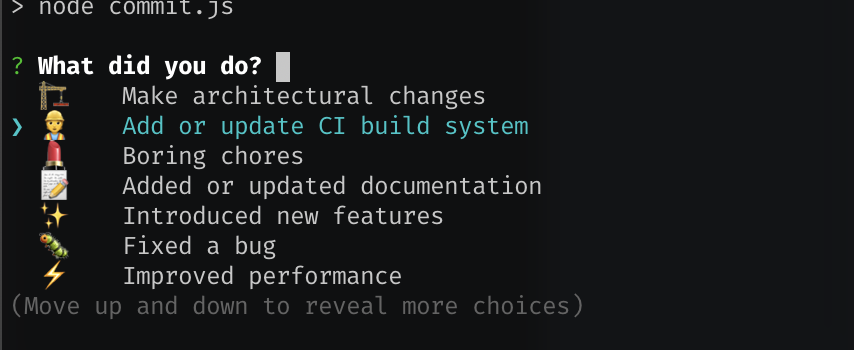
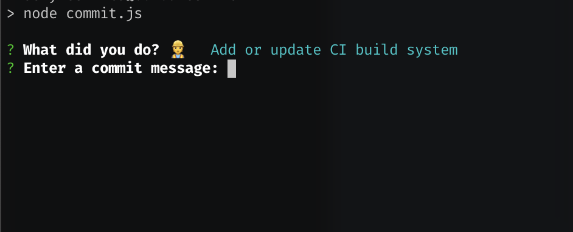

<!-- ⚠️ This README has been generated from the file(s) "README" ⚠️--><p align="center">
  
</p> <p align="center">
  <b>Sexy commits using gitmoji.dev and inquirer-autocomplete-prompt</b></br>
  <sub><sub>
</p>

<br />


[](https://semver.org)

Sexy commits using your config from `package.json`.

Uses `gitmoji` mapping config from your `package.json` and `inquirer` to prompt you for what you did and a brief explanation (used as commit message).

```json
{
  "gitmoji": {
    "build": [
      "🏗️",
      "Make architectural changes"
    ],
    "ci": [
      "👷",
      "Add or update CI build system"
    ],
    "chore": [
      "💄",
      "Boring chores"
    ]
  }
}
```


[](#this-is-how-it-works)

## ➤ This is how it works

### Add npm script

Add npm script `commit` that runs `sexy-commits`.

```json
{
  "scripts": {
    "commit": "sexy-commits"
  }
}
```


### Run the script

```shell
npm run commit
```


### Select what you did



### Enter a short summary



### With arguments

You can also call run `sexy-commits`with args.

```shell
npm run commit [add] [type] [message]
```


Where **[add]** is what do add - either `all`or a pattern, and **[type]** is what kind of change you did (depends on your `gitmoji` config).

#### Example 1

You did a **fix** and want to commit **all changes**:

```shell
npm run commit all fix
```


#### Example 2

You did a **style** adjustment and want to commit only what's in the **theme** folder.

```shell
npm run commit style theme "updated dark theme"
```

### Alias support

With `v0.3.1`we introduces alias support. Add a third element to your gitmoji config which is an array of aliases. Here you can see we mapped `build` to **ci** and `boring`and `chores`to **chore**.

```json
{
  "gitmoji": {
    "ci": [
      "👷",
      "Add or update CI build system",
      ["build"]
    ],
    "chore": [
      "💄",
      "Boring chores",
      ["boring", "chores"]
    ]
  }
}
```

#### Example 1

You can now do the following:

```shell
npm run commit boring "it's so boring to use regular git commits"
```

### Auto push
You can auto push your changes by setting `SEXY_COMMITS_AUTO_PUSH` to `1` in your .env file.

### Add skip ci tag
If you want to add skip ci tag to your commit, set the `SEXY_COMMITS_SKIP_CI_TAG` variable in your .env file.

#### Example 
```Dotenv
SEXY_COMMITS_SKIP_CI_TAG=[skip-ci]
```

### Lint your changes before commiting
By specifying `SEXY_COMMITS_LINT_CMD` in your .env file, we can lint your changes before commiting (e.g. with [ESLint](https://eslint.org/)).


#### Example 
```Dotenv
SEXY_COMMITS_LINT_CMD=npm run-script lint
```

[](#contributors)

## ➤ Contributors
	

| [](undefined) | [](undefined) |
|:--------------------------------------------------:|:--------------------------------------------------:|
| [Ole Martin Pettersen](undefined)                | [Carl Joakim Damsleth](undefined)                |
| [olemp@puzzlepart.com](mailto:olemp@puzzlepart.com) | [carl.joakim.damsleth@puzzlepart.com](mailto:carl.joakim.damsleth@puzzlepart.com) |
 

### Working with issues
You can automatically tag and/or close issues automatically when commiting with `sexy-commits`.

By specifying `SEXY_COMMITS_ISSUE_REF` in your .env file, the commit will automatically tag the issue. Do not specify the issue number with the #.

By also providing `SEXY_COMMITS_FIXES_ISSUE`, the issue will automatically be closed when commiting.